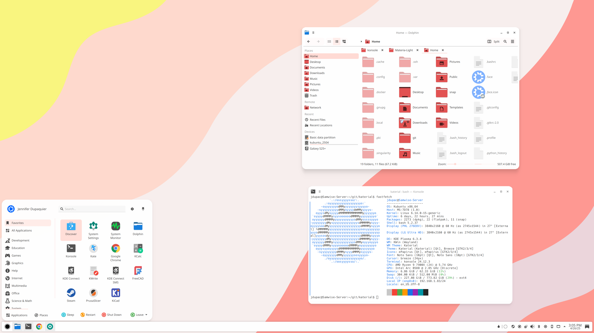

# Katerial (KDE Material Design Theme)
Fork of Nova suite for Plasma Desktop (https://github.com/varlesh/nova-kde)

Also pulling in elements from Materia KDE (https://github.com/PapirusDevelopmentTeam/materia-kde)

The goal of this project is to create a modern theme for KDE Plasma based on Material Design, updated for Plasma 6. 

## WORK IN PROGRESS

- Color scheme: Katerial
- Application Style: Kvantum (Katerial)
- Plasma Style: Katerial
- Window Decorations: Katerial
- Icons: Papirus
- Cursor: Breeze Light
- Wallpaper: Katerial

## To install:
- Clone this repo
- Copy the directory: aurorae/themes/Katerial/ to ~/.local/share/aurorae/themes/, then set 'window decorations'
- Copy the directory: plasma/desktoptheme/Katerial/ to ~/.local/share/plasmaqa/desktoptheme/, then set 'plasma style'
- Copy the file: Katerial.colors to ~/.local/share/color-schemes/, then set 'color scheme'
- Install Kvantum, set as application style. In Kvantum, install and load Kvantum/Katerial/ directory
- Download and install Papirus icon set
- (Optional) set wallpaper included in this repo

## To be updated:
- Plasma Style (?)
- Cursor (?)
- Panel
- SDDM
- Alternate color schemes
