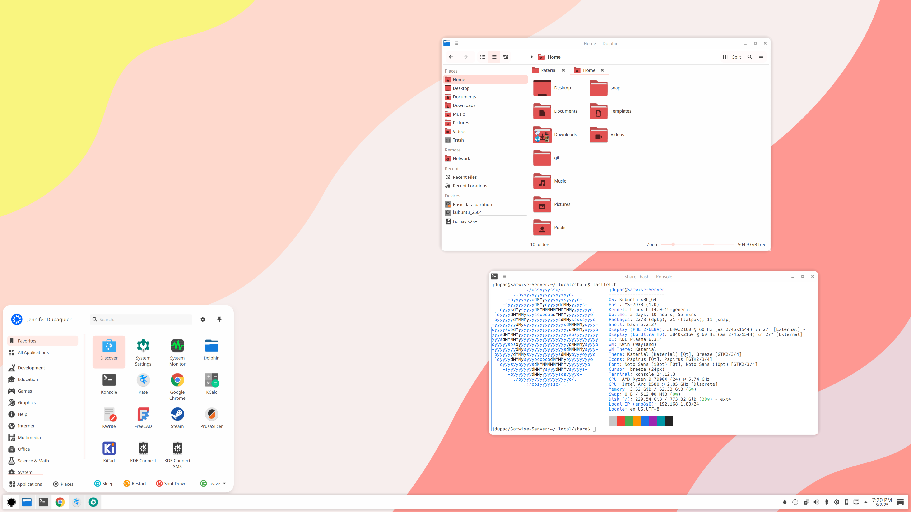

# Katerial (KDE Material Design Theme)

The goal of this project is to create a modern theme for KDE Plasma based on Material Design, updated for Plasma 6. 

Started as a fork of [Nova suite for Plasma Desktop](https://github.com/varlesh/nova-kde). Plasma style is changed the least, I just tweaked the taskbar item backgrounds. Kvantum theme is using the same base svg file, but recolored to match the new color scheme. The SDDM and lookandfeel themes in this repo are untouched since I forked from Nova. I am planning to update those, I just haven't gotten to it. 

Aurorae window decorations are a mix of [Materia KDE](https://github.com/PapirusDevelopmentTeam/materia-kde) icons plus [Utterly Round](https://github.com/HimDek/Utterly-Round-Plasma-Style) decoration. 

The color scheme I recreated from scratch. 

I didn't even bother with icons, [Papirus](https://github.com/PapirusDevelopmentTeam/papirus-icon-theme) is *chef's kiss*. 

## Screenshot:

- Color scheme: Katerial Light Red/Pink
- Application Style: Kvantum (Katerial Light Red/Pink)
- Plasma Style: Katerial Light
- Window Decorations: Katerial Light
- Icons: Papirus
- Cursor: Breeze Light
- Wallpaper: Katerial

## To install:
- Clone this repo
- Copy the directory: aurorae/themes/Katerial/ to ~/.local/share/aurorae/themes/, then set 'window decorations'
- Copy the directory: plasma/desktoptheme/Katerial/ to ~/.local/share/plasmaqa/desktoptheme/, then set 'plasma style'
- Copy the file: Katerial.colors to ~/.local/share/color-schemes/, then set 'color scheme'
- Install Kvantum, set as application style. In Kvantum, install and load Kvantum/Katerial/ directory
- Download and install Papirus icon set
- (Optional) set wallpaper included in this repo

## Available color schemes:
Plasma style and Aurorae window decorations only need light/dark variants, the rest will use your system color scheme. Colorscheme and Kvantum theme need individual variants. Available variants are:

- Light
    - Red/Pink
    - More planned in future but not available yet
- Dark
    - No immediate plans to support, but not against it if demand is there
    

## To be updated:
- Cursor (I don't hate breeze, but I don't love it)
- SDDM (procrastinating)
- Alternate color schemes (if anyone wants a specific color scheme, feel free to raise an issue or PR)
